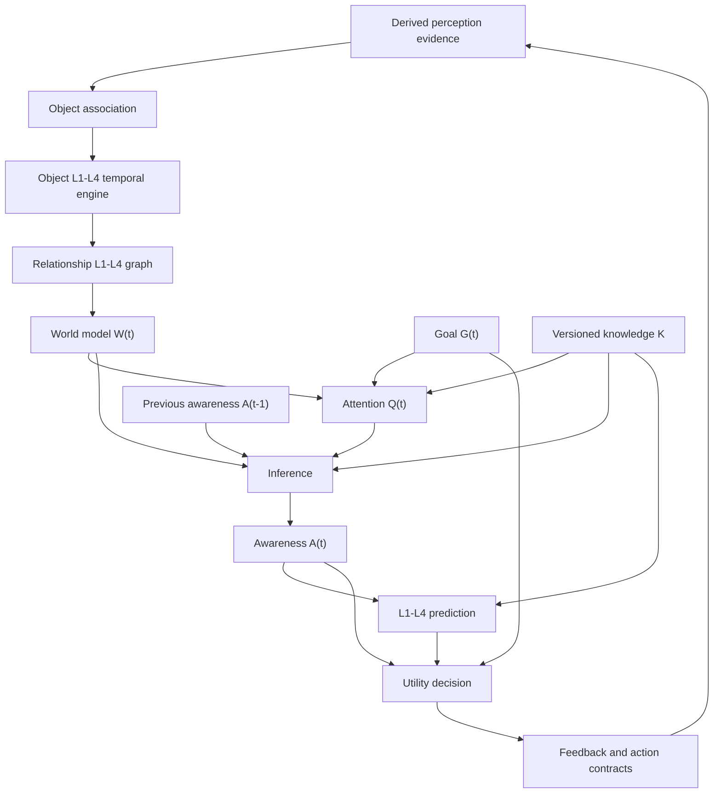

# Multiscale Combat Awareness System

## Architecture, implementation status, operations, and roadmap

**Project:** XMartialArt / Martial Art AI  
**Primary admin interface:** `/admin-awareness`  
**Document updated:** 2026-08-17
**Implementation status:** Complete end-to-end software architecture except the deliberately deferred YOLO/object-detector runtime. Scene geometry, durable memory governance, action-delivery audit, and the live admin console are implemented and verified.

---

## 1. Purpose

The Multiscale Combat Awareness System converts live training observations into a goal-relevant, knowledge-informed understanding of the current situation. It is designed to distinguish four separate concepts:

- **Perception:** what the sensors observed.
- **World model:** objects, temporal state, space, and relationships.
- **Awareness:** the interpreted, goal-relevant current situation.
- **Reasoning and action:** what is likely to happen and what the system should do next.

The main architecture is:

```text
Camera / derived sensors
        ↓
Perception contracts and fusion
        ↓
Object association and stable identity
        ↓
Every object → L1 → L2 → L3 → L4
        ↓
Every relationship → R-L1 → R-L2 → R-L3 → R-L4
        ↓
World model W(t)
        ↓
Goal G(t) + Attention Q(t) + Knowledge K + Previous Awareness A(t-1)
        ↓
Inference → Awareness A(t)
        ↓
Multiscale prediction Ŵ(t+h)
        ↓
Utility-based reasoning and decision
        ↓
Visual / audio / haptic / system action contracts
        ↓
New observations → repeat the loop
```

---

## 2. Core equations

### Sensor and perception

```text
C(t) = Sensor(World(t))

P(t) = Fusion(
  HumanPerception(C(t)),
  ObjectDetector(C(t)),
  SceneSegmentation(C(t)),
  Geometry(C(t))
)
```

Raw camera media is not persisted by the awareness backend. The backend accepts derived perception evidence through strict contracts.

### Objects

```text
Oᵢ(t) = Track(P(t), Oᵢ(t-1))

Mᵢ(t) = {
  L1ᵢ(t),
  L2ᵢ(t),
  L3ᵢ(t),
  L4ᵢ(t)
}
```

### Relationships

```text
Rᵢⱼ(t) = Relate(Oᵢ(t), Oⱼ(t))

Rᵢⱼ(t) = {
  R-L1ᵢⱼ(t),
  R-L2ᵢⱼ(t),
  R-L3ᵢⱼ(t),
  R-L4ᵢⱼ(t)
}
```

### World, awareness, and prediction

```text
W(t) = Objects^(L1-L4) + Relationships^(L1-L4) + Space + Time + History

Q(t) = Attention(W(t), G(t), A(t-1), K)

A(t) = Inference(W(t), A(t-1), K, G(t), Q(t))

Ŵ(t+h) = Predict(A(t), K, h)
```

### Decision

```text
D*(t) = argmax_d Utility(d | A(t), K, G(t), Ŵ(t+h))

Utility =
  w1 × Defense
  + w2 × Balance
  + w3 × Power
  + w4 × Mobility
  - w5 × Exposure
  - w6 × JointStress
  - w7 × EnergyWaste
```

---

## 3. Temporal layers

### L1 — immediate state and motion

**Time scale:** milliseconds to approximately 100 ms.  
**Question:** How is this object changing now?

The engine derives or preserves:

- Position and orientation.
- Velocity and acceleration.
- Angular velocity when supplied.
- Speed and immediate motion state.
- State transitions such as `stationary_to_moving`.
- Confidence.
- Detector-specific L1 evidence such as pose angles and tracking values.

### L2 — event and action

**Time scale:** approximately 100 ms to seconds.  
**Question:** What is this object doing?

The engine derives or preserves:

- Event and action.
- Action phase.
- Direction.
- State transition.
- Confidence.
- Existing Studio classifications such as step state, temporal phase, mistake risk, and likely mistake.

### L3 — session pattern

**Time scale:** seconds to the current training session.  
**Question:** What pattern is developing?

The engine maintains:

- Action/event frequency.
- Dominant behavior.
- Repeated patterns.
- Error evidence.
- Adaptation state.
- Fatigue effect.
- Session state and observation count.

### L4 — long-term evolution

**Time scale:** sessions to long-term development.  
**Question:** How is this object evolving?

The engine represents:

- Evolution: improving, stable, or degrading.
- Long-term and persistent patterns.
- Learning and degradation signals.
- Adaptation.
- Sessions and lifetime observations.
- Existing long-term Studio user context, including learning trend and persistent weakness.

Current L4 state is included in persisted awareness snapshots and in dedicated object and relationship memory aggregates. These aggregates survive bounded awareness-session retention and hydrate a later session for the same user. Cross-session identity is deliberately conservative: only stable IDs already supplied by verified evidence are reused; future detector-specific identity policies must not guess that two people or pieces of equipment are the same entity.

---

## 4. Relationship model

Every verified pair with usable spatial evidence can form an evidence-backed relationship.

### Relationship L1

- Distance.
- Relative position.
- Relative velocity.
- Closing speed.
- Contact.
- Estimated time to contact.
- Reachability when reach evidence exists.
- Floor support relationship.
- Wall movement restriction.

### Relationship L2

- Contact started, contact, or contact ended.
- Closing, separating, or stable.
- Interaction phase and direction.
- State transition and confidence.

### Relationship L3

- Repeated interaction patterns.
- Dominant relational behavior.
- Frequency and session state.
- Session observation history.

### Relationship L4

- Persistent relational state.
- Long-term relational pattern.
- Evolution and adaptation.
- Sessions and lifetime observations.

No relationship is invented without verified endpoint evidence and usable geometry.

---

## 5. World model pipeline



The current engine identifiers are:

- `object-association/v1`
- `object-l1-l4/v1`
- `relationship-l1-l4/v1`
- `history-goal-attention/v2`
- `multiscale-l1-l4/v2`
- `utility-decision-policy/v2`

---

## 6. Goals and attention

The administrator can select the active goal from the awareness page:

- `improve_user_technique`
- `maximize_defense`
- `evaluate_balance`
- `detect_threat`

Attention produces:

- Overall priority for every object and relationship.
- Level-specific L1, L2, L3, and L4 priorities.
- Auditable reasons for each priority.
- A selected focus target.
- Computation budgets: realtime, high, normal, or deferred.

Unverified observations receive a confidence penalty and cannot become the active verified focus.

---

## 7. Knowledge architecture

Knowledge is versioned and governed separately from live awareness.

The default profile contains:

- **K_L1:** physics, geometry, kinematics, biomechanics, joint constraints, gravity, balance, and motion models.
- **K_L2:** techniques, actions, combat patterns, event definitions, state transitions, attacks, and defenses.
- **K_L3:** fatigue, repetition, session rules, behavior, and adaptation.
- **K_L4:** learning curves, skill progression, long-term adaptation, degradation, and historical trends.
- **K_relation:** distance, reach, threat zones, collisions, support, interaction constraints, and causal patterns.
- **K_world:** object identity, space, time, confidence, and history.

Knowledge profiles follow this workflow:

```text
Draft → In review → Active → Retired
```

Only one version can be active. Decision evaluations record the knowledge profile and version used.

---

## 8. Awareness output

Backend awareness contains:

- Current situation state.
- Previous situation state and state transition.
- Attention target.
- Relevant evidence.
- Threats.
- Opportunities.
- Session and long-term patterns.
- Confidence and uncertainty.
- Recommended next action.

Common states include:

- `waiting_for_perception`
- `tracking_unclear`
- `observing`
- `correcting`
- `hazard_detected`

The inference engine uses persisted previous awareness when a session resumes after a backend restart.

---

## 9. Prediction

Prediction is evidence-gated and includes:

- **L1 / +100 ms:** projected immediate position and confidence.
- **L2 / +1 second:** projected position, next action, likely mistake, and collision risk.
- **L3 / session:** repeated pattern, fatigue risk, and recommendation.
- **L4 / long term:** evolution, persistent state, learning, degradation, and relational evolution.

Predictions that do not meet configured trust thresholds remain gated and cannot silently become facts.

---

## 10. Reasoning, decision, and actions

The decision layer evaluates bounded candidates using governed utility weights. It returns:

- Candidate utility values.
- Selected command.
- Decision confidence.
- Reasons and evidence.
- Forecast risks.
- Feedback type and message.
- Whether training should pause.
- Whether feedback should be spoken.

Structured action contracts support:

- **Visual:** display feedback.
- **Audio:** speak feedback.
- **Haptic:** issue a safety pattern; requires a device adapter.
- **System:** continue, observe, hold, improve camera view, or pause for a verified hazard.

Safety remains evidence-gated. A verified hazard is the only state that forces a training pause.

---

## 11. Perception status

### Implemented now

- MediaPipe-derived human pose/hands/face data from Studio.
- Strict human, object, surface, and geometry contracts.
- Confidence-gated perception fusion.
- Built-in privacy-safe pose-ground scene segmentation that emits compact floor and camera-field wall polygons.
- MediaPipe world-landmark geometry that emits a camera-relative ground plane, user 3D position, scale estimate, camera pose metadata, and calibration metadata.
- Live floor and wall world nodes with confidence and verification state.
- Rejection of raw frame fields at the backend contract boundary.
- Truthful module status: ready, disabled, or model missing.
- No raw media persistence in awareness records.

### Deliberately deferred

- **YOLO/object-detector runtime and weights.**

YOLO remains disabled until a future integration supplies a real model, preprocessing contract, label policy, confidence calibration, and performance validation.

### Optional future perception upgrades

- Dense semantic segmentation may later refine the built-in floor/wall regions.
- Metric monocular/stereo depth may later refine the current camera-relative MediaPipe geometry.

These are accuracy upgrades, not missing architecture components. The current scene and geometry modules truthfully report `ready` when live pose-ground evidence is available.

---

## 12. Admin interface

The `/admin-awareness` page provides:

- Live Studio Train Mode camera and feedback.
- Technique selection from the manual catalog.
- Goal selection.
- Performance, voice, text, mirror, L1, and ACP controls.
- Backend connection and inference state.
- Truthful perception-module readiness.
- Object and relationship world graph.
- Computed backend object L1–L4.
- Computed relationship L1–L4.
- Current awareness, confidence, and uncertainty.
- Previous awareness state.
- Prediction timeline.
- Utility-selected decision.
- Client/backend decision comparison.
- Recent awareness events.
- Knowledge-profile governance.
- Decision-evaluation history.

The page intentionally omits the general site footer and focuses available space on awareness diagnostics.

---

## 13. Backend API

User runtime routes require an authenticated account and are always scoped to that account's user ID. Governance, global diagnostics, retention administration, knowledge activation, and admin session inspection remain administrator-only.

### User runtime

| Method | Route | Purpose |
|---|---|---|
| WS | `/awareness/stream` | Process live user Studio perception and return governed actions. |
| GET | `/awareness/memory` | Export the authenticated user's long-term awareness memory. |
| DELETE | `/awareness/memory` | Delete the authenticated user's long-term awareness memory. |
| POST | `/awareness/sessions/{session_key}/deliveries` | Record user action-delivery acknowledgements. |
| GET | `/awareness/sessions/{session_key}/deliveries` | Read the user's delivery history for that session. |

### Sessions and snapshots

| Method | Route | Purpose |
|---|---|---|
| GET | `/admin/awareness/sessions` | List awareness sessions. |
| POST | `/admin/awareness/sessions/{session_key}/snapshots` | Process a complete awareness snapshot. |
| POST | `/admin/awareness/sessions/{session_key}/perception` | Fuse and process a perception envelope. |
| GET | `/admin/awareness/sessions/{session_key}/snapshot` | Load the latest persisted snapshot. |
| GET | `/admin/awareness/sessions/{session_key}/events` | Load compact transition events. |
| GET | `/admin/awareness/sessions/{session_key}/evaluations` | Load client/backend decision evaluations. |

### Perception and operations

| Method | Route | Purpose |
|---|---|---|
| GET | `/admin/awareness/perception/modules` | Report truthful perception-module status. |
| GET | `/admin/awareness/retention` | Show retention policy. |
| POST | `/admin/awareness/retention/prune` | Preview or execute retention pruning. |

Pruning defaults to `dry_run=true`. Actual deletion requires an explicit `dry_run=false`.

### Knowledge governance

| Method | Route | Purpose |
|---|---|---|
| GET | `/admin/awareness/knowledge` | Load the active knowledge profile. |
| GET | `/admin/awareness/knowledge/profiles` | List governed versions. |
| POST | `/admin/awareness/knowledge/profiles` | Create a draft. |
| POST | `/admin/awareness/knowledge/profiles/{id}/submit` | Submit a draft for review. |
| POST | `/admin/awareness/knowledge/profiles/{id}/activate` | Activate a reviewed profile. |
| POST | `/admin/awareness/knowledge/validate` | Validate a profile contract. |

### WebSocket

```text
WS /awareness/stream
WS /admin/awareness/stream
```

The user route accepts any authenticated account and the admin route additionally enforces the admin role. The client first sends an authentication message, then publishes `snapshot` or `perception` messages. Acknowledgements include:

- Backend inference.
- Multiscale prediction.
- Utility decision and actions.
- Client/backend comparison.
- World-model metadata.
- Computed objects and relationships.
- Attention scores.

---

## 14. Persistence

PostgreSQL tables:

- `awareness_sessions`
- `awareness_events`
- `awareness_knowledge_profiles`
- `awareness_decision_evaluations`
- `awareness_object_memories`
- `awareness_relationship_memories`
- `awareness_action_deliveries`

Persisted data includes:

- Latest complete world snapshot per user/session.
- Compact meaningful transition history.
- Client/backend agreement evaluations.
- Knowledge version used for each evaluation.
- Object and relationship L1–L4 state embedded in snapshots.
- Durable per-user object and relationship L4 aggregates across sessions.
- Idempotent action-delivery acknowledgements for audit and evaluation.

Current migration head:

```text
e9c3a5b7d812
```

Migration portability was corrected so upgrade/check/downgrade works with PostgreSQL and the SQLite migration test environment.

---

## 15. Security, privacy, and operations

- Authentication and per-user ownership are required for user awareness processing, memory, and delivery audit routes.
- Admin authorization is required for governance, global diagnostics, retention administration, and `/admin/awareness/*` access.
- Strict Pydantic contracts reject unexpected perception fields.
- Raw RGB/depth media is not persisted by awareness services.
- WebSocket payload size is limited.
- WebSocket message rate is limited.
- Unverified evidence cannot create verified relationships.
- Retention pruning is preview-only by default.
- Awareness processing duration, count, and verified-entity metrics are emitted through OpenTelemetry when configured.
- Logs use the application redaction and request-correlation infrastructure.

### Environment variables

| Variable | Default | Purpose |
|---|---:|---|
| `AWARENESS_WS_MESSAGES_PER_SECOND` | `10` | WebSocket rate cap. |
| `AWARENESS_SESSION_RETENTION_DAYS` | `30` | Session retention. |
| `AWARENESS_EVENT_RETENTION_DAYS` | `14` | Event retention. |
| `AWARENESS_EVALUATION_RETENTION_DAYS` | `30` | Evaluation retention. |
| `AWARENESS_DELIVERY_RETENTION_DAYS` | `30` | Action-delivery audit retention. |
| `AWARENESS_MEMORY_HALF_LIFE_DAYS` | `180` | Dynamic L4 memory-confidence half-life. |
| `AWARENESS_PROCESSING_BUDGET_MS` | `100` | Backend snapshot-processing latency budget reported to the admin client. |
| `MEDIAPIPE_ENABLED` | `true` | Human-perception status. |
| `OBJECT_DETECTOR_ENABLED` | `false` | Future detector switch. |
| `OBJECT_DETECTOR_MODEL_PATH` | empty | Future detector asset. |
| `SCENE_SEGMENTATION_ENABLED` | `true` | Built-in pose-ground scene adapter switch. |
| `DEPTH_GEOMETRY_ENABLED` | `true` | Built-in MediaPipe world-geometry adapter switch. |

---

## 16. Implementation map

| Concern | Primary implementation |
|---|---|
| Contracts | `backend/awareness/schemas.py` |
| Perception fusion | `backend/awareness/perception.py` |
| Object identity | `backend/awareness/object_association.py` |
| Object L1–L4 | `backend/awareness/temporal.py` |
| Relationship L1–L4 | `backend/awareness/relationships.py` |
| Attention | `backend/awareness/attention.py` |
| Inference | `backend/awareness/inference.py` |
| Prediction | `backend/awareness/prediction.py` |
| Utility decision/actions | `backend/awareness/reasoning.py` |
| Pipeline orchestration | `backend/awareness/world_model.py` |
| Knowledge | `backend/awareness/knowledge.py` and `backend/data/awareness/default.v1.json` |
| Persistence | `backend/awareness/repository.py` |
| Retention | `backend/awareness/retention.py` |
| User/admin API transport | `backend/routers/awareness.py` |
| Database models | `backend/models/awareness.py` |
| Admin UI | `frontend/src/pages/AdminAwareness.jsx` |
| Shared user/admin perception envelope | `frontend/src/perception/awarenessEnvelope.js` |
| User Studio awareness delivery | `frontend/src/modes/TrainMode.jsx` |
| WebSocket client | `frontend/src/services/awarenessStream.js` |

---

## 17. Completed work

### Frontend

- Created `/admin-awareness` as an admin-focused diagnostics page.
- Embedded compact Studio Train Mode instead of a duplicate camera panel.
- Added maximum-space responsive layout and scrollable diagnostics.
- Added technique and goal selection.
- Added compact performance, voice, text, mirror, L1, and ACP controls.
- Added world, object, relationship, prediction, reasoning, event, governance, and evaluation panels.
- Removed page-specific duplicate panels and the general footer.
- Connected the page to the authenticated awareness WebSocket.
- Connected ordinary authenticated Train Mode sessions to the shared backend orchestrator through `/awareness/stream`.
- Made governed backend visual/audio/system/haptic actions authoritative in user Train Mode while retaining local Studio guidance as the offline/low-latency fallback.
- Added user-scoped delivery audit and memory export/delete routes without exposing admin governance.
- Added strict `perception/v1` publishing from the live Studio rather than trusting a client-authored awareness result.
- Added built-in floor/wall and camera-relative geometry evidence without transmitting raw camera pixels.
- Added action-delivery acknowledgements for visual, audio, browser haptic, and system actions.
- Added persisted action-delivery history and long-term-memory export, delete, refresh, confidence, and lifetime-summary controls.
- Added backend processing latency and budget status to the decision diagnostics.

### Backend

- Added strict schemas, fusion, association, L1–L4 temporal processing, relationships, attention, inference, prediction, utility decisions, and action contracts.
- Added previous-awareness closed-loop processing.
- Added client/backend comparison and evaluation recording.
- Added knowledge governance and version activation.
- Added persistence, retention, rate limiting, and observability.
- Added durable L4 object/relationship memory hydration across sessions.
- Added exponential L4 confidence decay plus scoped memory export and deletion.
- Added idempotent action-delivery persistence and retention pruning.
- Added per-snapshot processing latency and budget metadata to HTTP/WebSocket output.
- Added REST and WebSocket interfaces.

### Database and migrations

- Added awareness session/event persistence.
- Added knowledge and evaluation tables.
- Added durable object and relationship memory tables and upsert persistence.
- Added the action-delivery audit table and endpoints.
- Applied migrations to the configured PostgreSQL development database.
- Corrected legacy migration portability and unique-index metadata alignment.

### Verification completed

- **126 backend tests passed.**
- **326 backend subtests passed.**
- **180 frontend tests passed.**
- Awareness architecture tests passed.
- Migration upgrade/check/downgrade passed.
- Frontend ESLint passed.
- Frontend production build passed.
- Live `/admin-awareness` camera acceptance passed in an authenticated admin session. Human tracking, floor/wall confidence, scene and geometry readiness, Studio feedback, diagnostics, and action delivery updated together.
- ONNX Runtime now uses valid version-matched runtime sidecars, eliminating the previous loader/MIME failure.
- OpenAPI and knowledge-profile validation passed.

Build output reports existing large ONNX/WebAssembly chunks; this is a performance optimization opportunity, not a build failure.

---

## 18. Architecture coverage matrix

| Original architecture area | Status | Notes |
|---|---|---|
| Camera and human perception | Implemented | Studio MediaPipe-derived evidence. |
| Strict perception fusion | Implemented | Human/object/surface/geometry contracts. |
| Object detector runtime | Deferred | YOLO intentionally held for future work. |
| Scene segmentation runtime | Implemented | Privacy-safe pose-ground floor and camera-field wall regions. |
| Depth/geometry runtime | Implemented | Camera-relative MediaPipe ground plane, position, scale, and calibration metadata. |
| Object association | Implemented | Stable per-session IDs using evidence and proximity. |
| Every object L1–L4 | Implemented | Derived while preserving classifier evidence. |
| Every relationship L1–L4 | Implemented | Requires verified endpoints and spatial evidence. |
| Durable L4 memory | Implemented | Dedicated per-user object/relationship aggregates hydrate later sessions. |
| Memory governance | Implemented | Export, scoped delete, confidence decay, summaries, and retention. |
| World graph | Implemented | Objects, relationships, confidence, and history. |
| Dynamic goal | Implemented | Four admin-selectable goals. |
| Level-specific attention | Implemented | Per-level priorities and compute budgets. |
| Versioned knowledge | Implemented | Governed profiles and domain catalog. |
| Previous awareness | Implemented | In-memory live loop plus persisted session recovery. |
| Integrated awareness | Implemented | Context, transitions, threats, opportunities, patterns, uncertainty. |
| L1–L4 prediction | Implemented | Evidence-gated multiscale forecasts. |
| Utility decision | Implemented | Governed bounded argmax selection. |
| Feedback/action contracts | Implemented | Visual/audio/haptic/system outputs. |
| User feedback orchestration | Implemented | The same governed backend orchestrator serves user Train Mode and the admin test console; local feedback is the fallback. |
| Action delivery audit | Implemented | Idempotent delivery acknowledgements persisted per user and exposed to the owning user/admin. |
| Haptic delivery | Browser simulator implemented | Uses `navigator.vibrate` where supported; physical device adapters still require hardware. |
| Closed loop | Implemented | Live snapshots continuously update the next state. |

---

## 19. What to do next

The requested non-YOLO architecture is complete. The items below are production hardening or optional accuracy/capability upgrades; they are not missing system layers.

### Priority 1 — cross-device and operational hardening

1. Repeat camera-permission acceptance on each supported browser/device combination.
2. Verify goal switching changes attention and decisions during a live session.
3. Verify network reconnect, browser refresh, backend restart, and duplicate snapshot behavior.
4. Add component-level visual/regression tests for the admin awareness panels.
5. Split the current end-to-end backend budget into perception, world update, prediction, decision, and feedback stage budgets.

### Priority 2 — longitudinal evaluation

1. Define identity policy across sessions for known equipment, environments, and future opponents.
2. Add scheduled L4 compaction; dynamic confidence decay is already active at read time.
3. Add longitudinal admin charts and knowledge-version comparisons.
4. Evaluate whether each delivered intervention improved following repetitions.

### Priority 3 — optional perception refinement

1. Consider dense semantic segmentation only if pose-ground floor/wall regions are insufficient.
2. Consider metric depth only if camera-relative MediaPipe geometry is insufficient.
3. Validate any replacement against the existing surface/geometry contracts and privacy boundary.
4. Benchmark CPU, WebGPU, and optional GPU execution before enabling an upgrade.

### Priority 4 — optional delivery refinement

1. Harden audio deduplication between backend actions and the existing Studio speech queue.
2. Define visual urgency and accessibility behavior.
3. Add optional physical haptic device capability negotiation.

### Priority 5 — policy evaluation

1. Create labeled evaluation tapes for tracking, actions, mistakes, relationships, predictions, and decisions.
2. Measure precision, recall, calibration, false safety alerts, and missed hazards.
3. Compare client classifications with backend results by knowledge version.
4. Add shadow-mode policy experiments before activating new knowledge.
5. Replace bounded rules with trained models only when evaluation data proves improvement and auditability is retained.

### Future — YOLO/object detection

This work remains intentionally deferred. Before enabling it:

1. Choose the object classes and safety policy.
2. Select a model and verify its license.
3. Add preprocessing and postprocessing adapters.
4. Calibrate per-class confidence thresholds.
5. Add tracking benchmarks and false-positive tests.
6. Run in shadow mode.
7. Enable verified-object promotion only after acceptance criteria pass.

---

## 20. Definition of done for production

The awareness system should be considered production-ready only when:

- Live browser acceptance passes on supported devices.
- Camera permission and reconnect behavior are reliable.
- Latency remains inside documented budgets.
- Safety states meet false-positive and false-negative thresholds.
- Predictions and decisions are calibrated on representative data.
- Long-term memory has explicit retention, deletion, and consent behavior.
- Every enabled perception module reports truthful health and model version.
- Action delivery is acknowledged and auditable.
- Knowledge changes pass review, shadow evaluation, and rollback tests.
- Monitoring, alerting, backup, and incident procedures are documented.

---

## 21. Short operational summary

The project now has a functioning end-to-end awareness foundation:

```text
MediaPipe/derived evidence
→ objects and stable identity
→ automatic object L1-L4
→ automatic relationship L1-L4
→ world model
→ goal and attention
→ previous-awareness inference
→ integrated awareness
→ multiscale prediction
→ governed utility decision
→ structured actions
→ persisted events/evaluations/delivery audit
→ durable L4 memory with export/delete/decay governance
→ live admin diagnostics
```

YOLO/object detection remains off by design and is the only deferred architecture subsystem. Built-in scene segmentation and MediaPipe world geometry are enabled, evidence-gated, privacy-safe, and verified in the live admin console.
