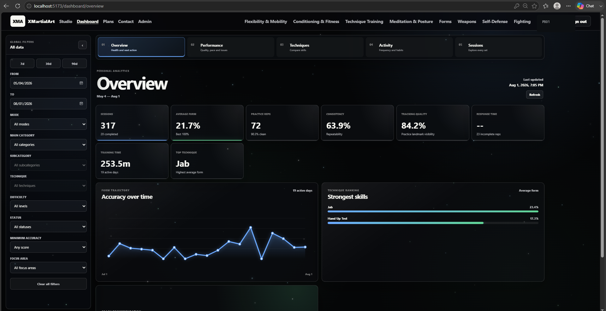
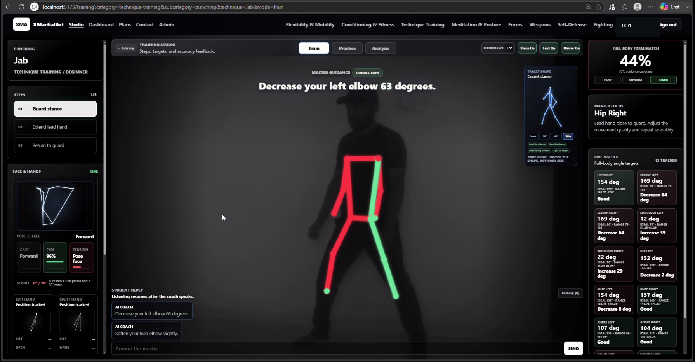
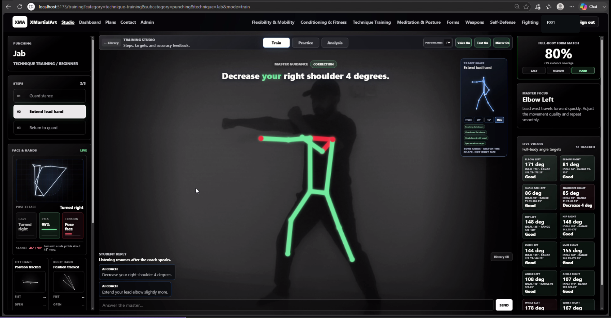
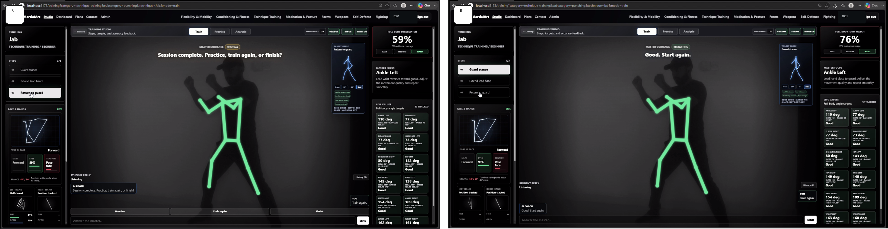
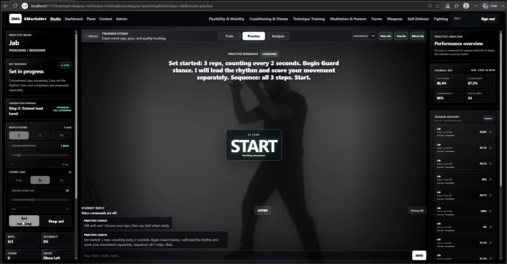
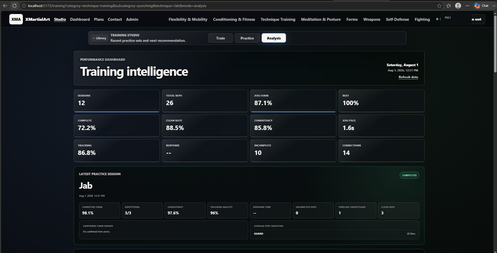
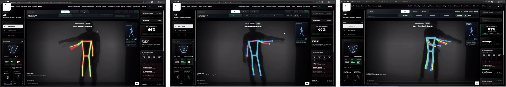
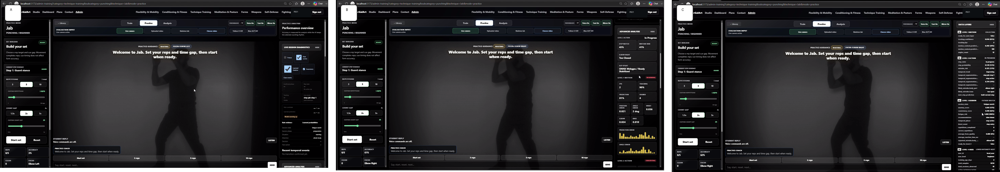

# A9 — System interface and functional evidence

These account-name-masked screenshots are the curated public subset used to
support the P001 jab-only laptop-camera feasibility case. The filenames describe
the displayed state and replace the original numeric screenshot names.

| File | Displayed evidence |
|---|---|
| `01-studio-mode-selection.png` | Train, Practice and Analysis mode selection |
| `02-dashboard-overview-and-filters.png` | Dashboard overview and global filters |
| `03-train-hard-prioritized-elbow-correction.png` | Prioritized quantified elbow correction |
| `04-train-hard-voice-step-transition.png` | Spoken-command transition to the next movement step |
| `05-train-hard-guard-related-shoulder-correction.png` | Shoulder correction during extension; guard meaning is expert interpretation |
| `06-train-hard-completion-and-restart.png` | Session completion choice and restarted training step |
| `07-easy-mode-hand-tracking-diagnostic.png` | Easy-mode hand-landmark diagnostic |
| `08-practice-mode-live-set.png` | Practice set builder and live repetition start |
| `09-practice-mode-full-session-analysis.png` | Three-cluster timeline and selected-frame analysis |
| `10-analysis-mode-dashboard.png` | Latest-session and historical analysis summaries |
| `11-admin-level1-level2-skeleton-overlay.png` | Observed L1, predicted L2 and combined skeleton views |
| `12-admin-diagnostics-and-data-layers.png` | Live diagnostics, L2 action analysis and L1–L4 data layers |

## Screenshot evidence

### A9.1 Studio mode selection

### A9.2 Dashboard overview and filters

### A9.3 Train Hard prioritized elbow correction

### A9.4 Train Hard voice step transition

### A9.5 Train Hard guard-related shoulder correction

### A9.6 Train Hard completion and restart

### A9.7 Easy-mode hand tracking diagnostic

### A9.8 Practice-mode live set

### A9.9 Practice-mode full-session analysis

### A9.10 Analysis-mode dashboard

### A9.11 Administrator L1/L2 skeleton overlay

### A9.12 Administrator diagnostics and data layers

The numerical values visible in these images are application outputs. Except
where separately supported by the report's controlled evidence, they must not be
interpreted as independently validated accuracy or effectiveness results.
